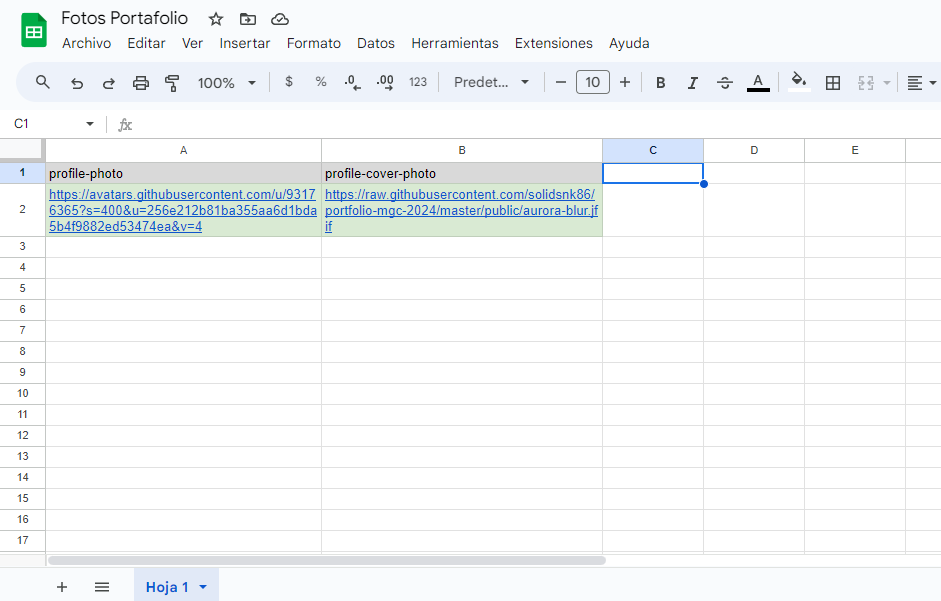

# Template para Portafolio

Este proyecto está desarrollado utilizando código duro: HTML, CSS y JavaScript. Este proyecto es un template que he creado para mostrar de manera simple tu portafolio web.

### Descripción

> [!Important]
> Este portafolio se creó para fines de presentación en la Facultad. Y seguir avanzando en la práctica.

### Características

Página de Inicio: Una introducción breve sobre mí, con enlaces rápidos a las secciones principales del portafolio.
Sobre Mí: Detalles sobre mi formación, experiencia y habilidades.
Proyectos: Una galería de mis proyectos más destacados, con descripciones y enlaces a demos o repositorios.
Contacto: Un formulario de contacto para que los interesados puedan enviarme un mensaje directamente desde la web.
Tecnologías Utilizadas
HTML5: Para estructurar el contenido de las páginas.
CSS3: Para el diseño y la presentación visual, utilizando técnicas modernas como Flexbox y Grid.
JavaScript: Para la interactividad y funcionalidades dinámicas.

> [!Note]
> Si te gusta éste template para tu portafolio puedes clonar este proyecto y hacerle modificaciones, sigue estos >pasos:

### Clona el repositorio:

```bash
git clone https://github.com/solidsnk86/portfolio-mgc-2024.git
```

### Navega al directorio del proyecto:

```bash
cd portfolio-mgc-2024
```

Abre el archivo index.html en tu navegador preferido.

### Contribuciones

Si deseas contribuir a este proyecto, no dudes en hacer un fork del repositorio y enviar un pull request con tus sugerencias o mejoras. Toda contribución es bienvenida.

### Cambio de las fotos del perfil desde Google Sheets

Este proyecto permite cambiar de manera rápida y dinámica las fotos de perfil y cover de usuario utilizando una planilla de Google Sheets. A continuación, se describen los pasos para configurar y utilizar esta funcionalidad.

<h3>Creamos una nueva hoja de cálculo de la siguiente manera siguiendo éstos pasos de las imágenes:</h3>

<div>
    
    <h3>En Archivo seleccionamos la opción de compartir y luego publicar en la web:</h3>
     
     <h3>Luego seleccionamos valores separados por comas, (.csv) y le damos a Publicar:</h3>
     
     <h3>Por último compiamos en enlace que nos genera:</h3>
     
</div>

### Y lo podemos manipular de la siguiente forma:

```javascript
const csv = {
  url: "URL_DE_GOOGLE_SHEETS.csv",
};

export const updatePhotoProfile = async () => {
  const res = await fetch(csv.url, { mode: "cors" });
  const data = await res.text();
  const retrievedData = data
    .split("\n")
    .slice(1)
    .map((row) => {
      const [photo_profile, profile_cover_photo] = row.split(",");
      return { photo_profile, profile_cover_photo };
    });
  return retrievedData;
};
```

Por último selecciono los elementos del DOM y conecto las url:

```javascript
import { updatePhotoProfile } from "/src/google-sheet-edit/googleSheetEdit.js";
const dynamic_url_photo = await updatePhotoProfile();
document.querySelector(".cover-photo").src =
  dynamic_url_photo[0].profile_cover_photo;
document.querySelector(".profile-picture").src =
  dynamic_url_photo[0].photo_profile;
```

#

<div align="center">
 <p>solidSnk86 Dev</p>
</div>
